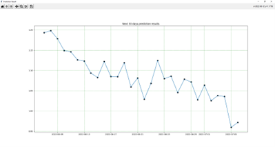

# Recurrent_with_Tkinter

############################################################# :slightly_smiling_face:
                                                                                                                     
##   5 Steps to run this program follow as                                                                             
##### 1) install python into your computer (recommend 3.8.12 of python version)                                            
##### 2) install requirement.txt file using "pip install -r requirements.txt in your shell" (or command prompt)             
##### 3) check and update data in 'excel_data.xlsx', trying to keep the information up to date                         
##### 4) run progaram with command "python run.py"                                                                      
##### 5) Enjoy it!                                                                                           
                                                                                                                    
############################################################# :slightly_smiling_face:

## In the user interface section

After running the program will get a window like this.

Next we will choose the time period that we want to predict, here will be the next 30 days.

Finally, this is the result of the prediction.

